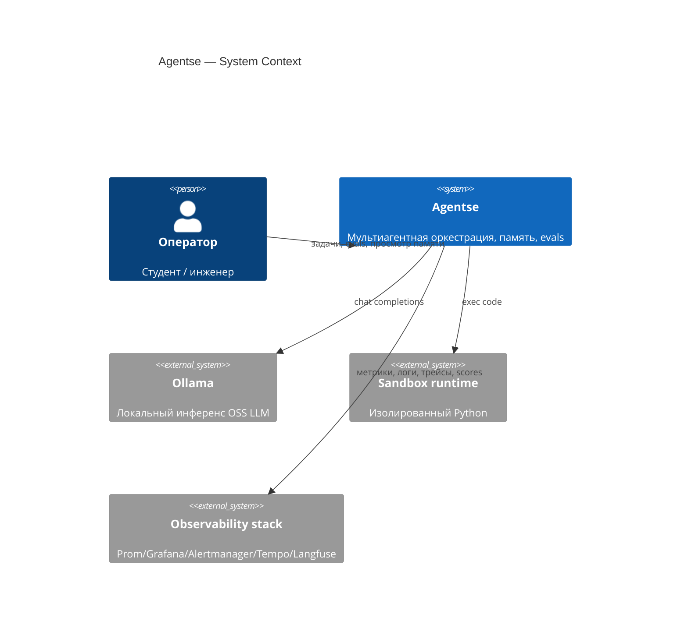
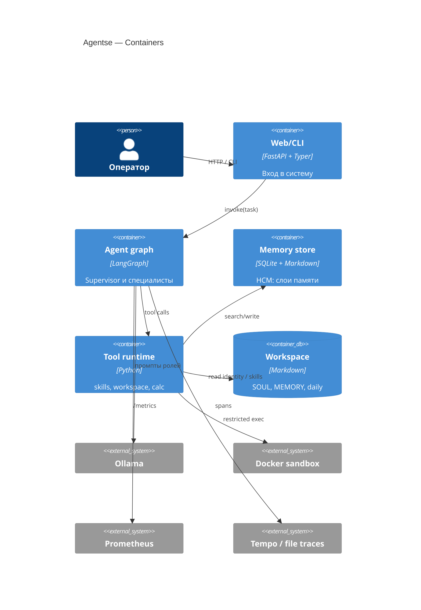
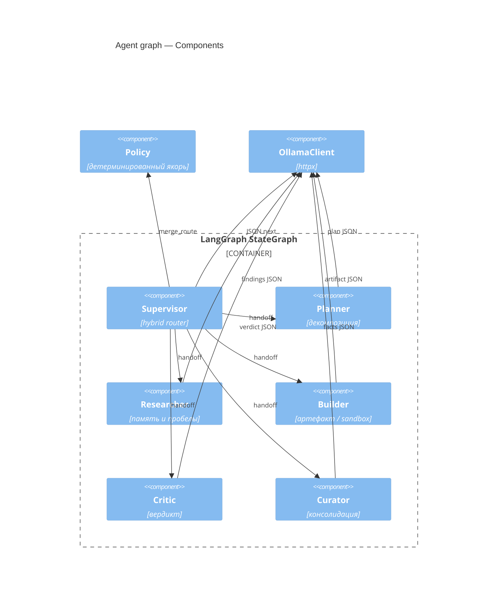

# C4 — Agentse

## Level 1. System Context

## Level 2. Containers

## Level 3. Components (граф)

## Level 4. Code (намеренно тонкий)

На L4 достаточно указателей в репозитории: `src/agentse/graph.py` (узлы), `agents/policy.py` (якорь), `memory/store.py` (HCM), `tools/sandbox.py` (изоляция). C4 не заменяет чтение этих файлов на защите.
