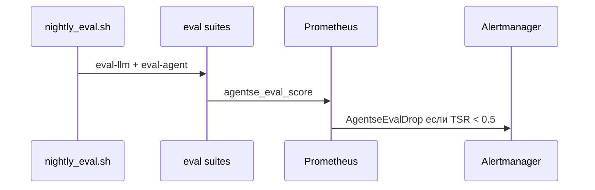

# Sequence — основные потоки

## Happy path

```mermaid
sequenceDiagram
    actor User
    participant Web
    participant Sup as Supervisor
    participant Pol as Policy
    participant Plan as Planner
    participant Res as Researcher
    participant Bld as Builder
    participant Crit as Critic
    participant Cur as Curator
    participant Mem as HCM
    participant Box as Sandbox
    participant LLM as Ollama

    User->>Web: задача
    Web->>Sup: invoke
    Sup->>Pol: нет плана?
    Pol-->>Sup: planner
    Sup->>Plan: handoff
    Plan->>Mem: memory_search
    Plan->>LLM: plan JSON
    Plan-->>Sup: plan[]
    Sup->>Pol: нет findings?
    Pol-->>Sup: researcher
    Sup->>Res: handoff
    Res->>Mem: search + graph
    Res->>LLM: findings JSON
    Res-->>Sup: findings[]
    Sup->>Bld: handoff
    Bld->>LLM: artifact
    opt code/calc
      Bld->>Box: sandbox_exec
      Box-->>Bld: stdout
    end
    Bld-->>Sup: artifacts
    Sup->>Crit: handoff
    Crit->>LLM: verdict
    Crit-->>Sup: approve
    Sup->>Cur: handoff
    Cur->>Mem: facts + entities
    Cur->>LLM: финальный текст
    Cur-->>User: ответ + маршрут
```

## Critic revise (негативный контур)

```mermaid
sequenceDiagram
    participant Bld as Builder
    participant Box as Sandbox
    participant Crit as Critic
    participant Sup as Supervisor
    Bld->>Box: код с import os
    Box-->>Bld: deny 403
    Bld-->>Sup: artifact + sandbox fail
    Sup->>Crit: handoff
    Crit-->>Sup: revise + required_fix
    Sup->>Bld: повтор (лимит 1–2)
    Note over Sup: max_steps / loop_guard → FINISH с долгом
```

## Eval / heartbeat


